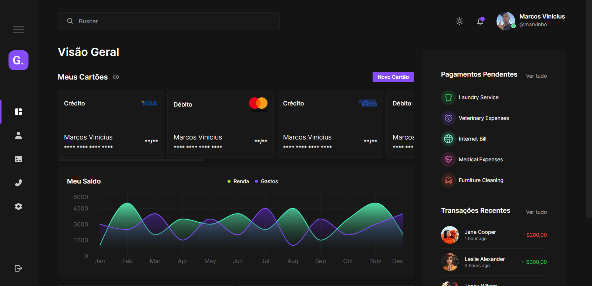
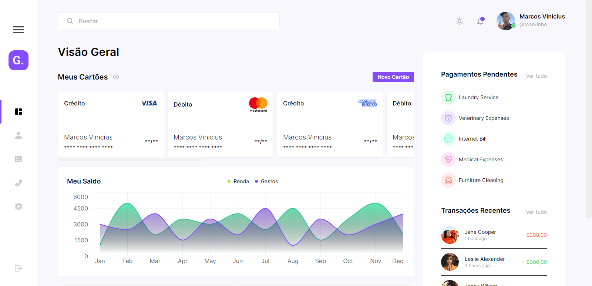
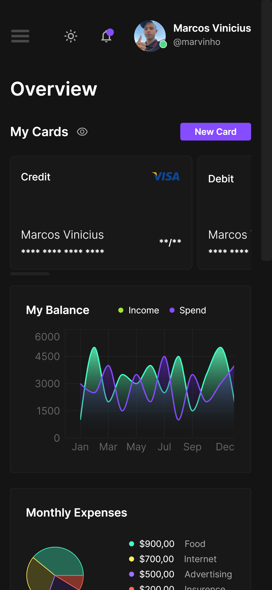
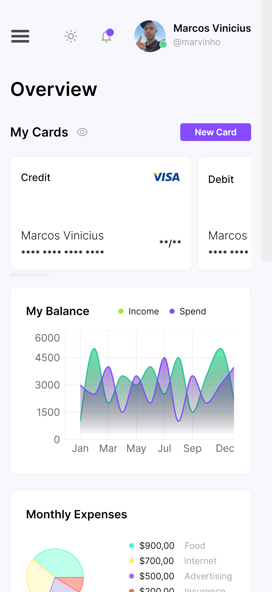

# financial-dashboard
 I was doing nothing browsing LinkedIn and saw a dashboard <a href="https://dribbble.com/shots/24032221-Financial-Dashboard">design</a> made by a designer called <a href="https://github.com/renanvilelati">Renan Vilela</a>, so as I was bored I decided to create the code using TypeScript, NextJS, TailwindCSS, the final result is in the screenshots below.

# What was used in the project?
Well, as previously stated, the project was created in TypeScript using NextJS and TailwindCSS, but I also used other libs such as <a href="https://github.com/pacocoursey/next-themes">next-themes</a> to manage the theme, <a href="https://github.com/amannn/next-intl">next-intl</a> for translations, <a href="https://github.com/recharts/recharts">recharts</a> for the graphics

# Demonstration
### Desktop - Dark Theme (Language PT/BR)

### Desktop - Light Theme (Language PT/BR)

### Mobile - Dark/Light Theme (Language EN/US)

    
    

